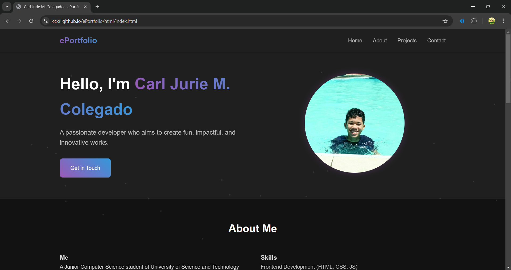
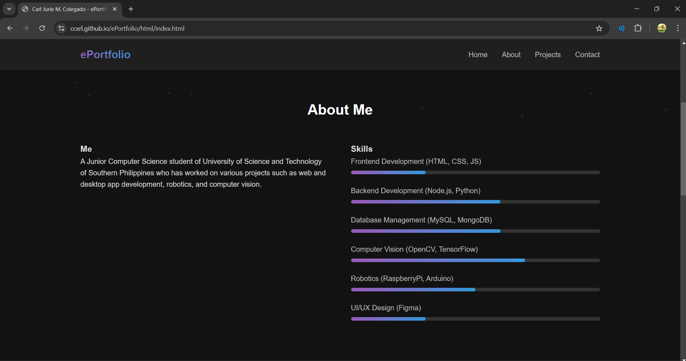
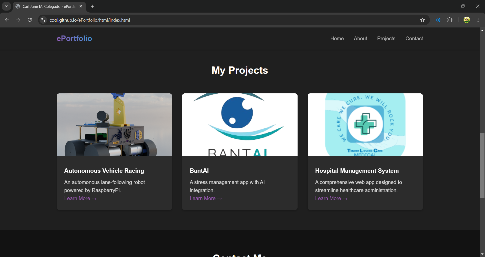
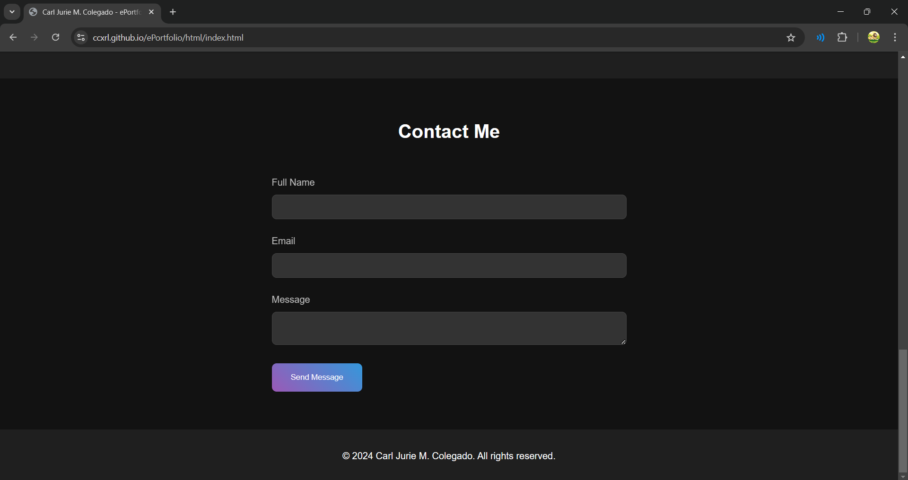

# ePortfolio

This is a simple ePortfolio project created using HTML, CSS, and JavaScript. It serves as a personal portfolio to showcase my work, and skills.

## Technologies Used

- HTML
- CSS
- JavaScript

## Instructions to Replicate or Contribute

1. Clone the repository or download the files.
2. Open the `index.html` file in your preferred browser to view the ePortfolio.
3. To contribute, feel free to fork the repository and submit a pull request with your changes.

